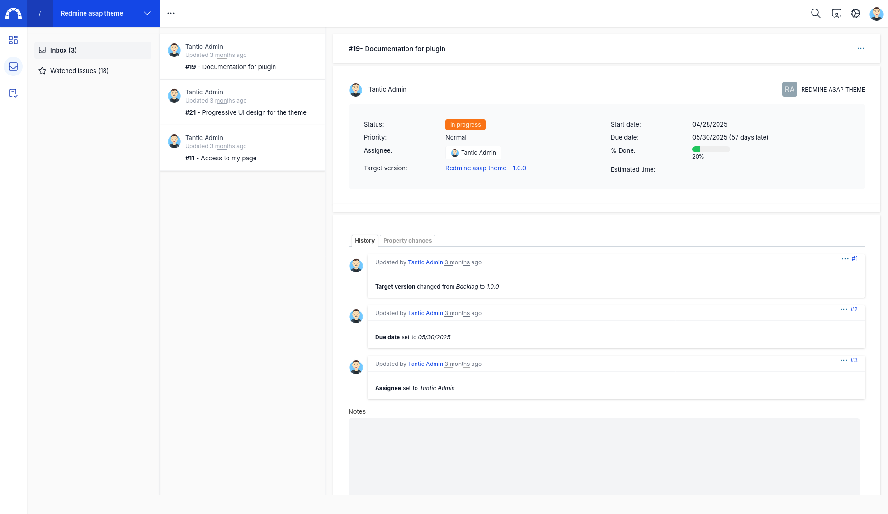

# Redmine asap user features

Plugin wich add some user features
* todo : each user has a personal space where he can manage his own tasks
* inbox : display personal issues from all the projects

# Prerequisite

You'll need to install Redmine asap theme : https://github.com/tantic/redmine_asap_theme

# Screenshots

# Installation

Same as usual

# Configuration

* Create a project, it will be the parent project of all the personal projects
* In the plugin configuration choose the parent project and the task tracker for the todo